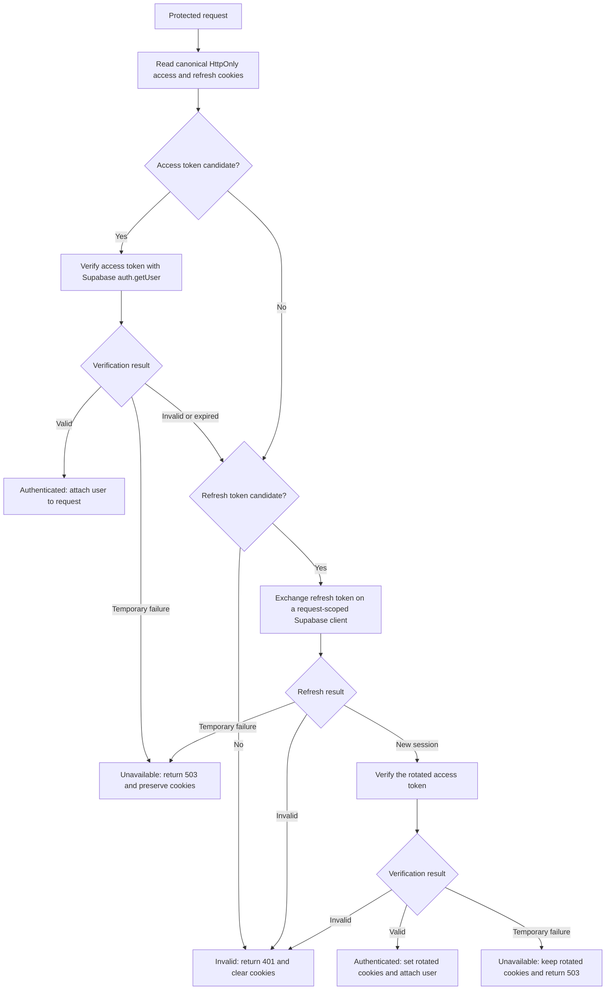

# Authentication and sessions

Supabase Auth is the identity provider. Express owns the application-facing session and cookie policy.

## Registration and login

1. The browser initializes CSRF through Express.
2. Registration/login payloads are validated with shared Zod schemas and stronger backend password rules.
3. Express calls Supabase Auth.
4. Login is rejected until `email_confirmed_at` is present.
5. Express returns generic errors to reduce user enumeration.
6. On success, Express writes separate HttpOnly access and refresh cookies.

## Protected requests and rotation

1. Express reads the access cookie and calls `supabase.auth.getUser`.
2. A valid access token continues without rotation.
3. An expired/terminal access token with a refresh cookie triggers a Supabase refresh.
4. The rotated access token is verified before the request is authorized.
5. New cookies replace the old session. The access cookie follows the JWT lifetime; the refresh cookie has a seven-day rolling browser lifetime by default.
6. Retryable Supabase failures return 503 and preserve the existing cookies. Terminal failures return 401 and clear them.

### Session resolution flow

The initial token-length checks are only input sanity checks. Supabase verification remains the
source of truth for whether a token identifies a valid user.

## OAuth

The frontend asks Express for the provider URL and redirects the browser. Supabase handles provider state. Express stores OAuth PKCE material server-side, exchanges the callback, writes cookies, and redirects back to the frontend.

Do not override Supabase's OAuth `state` query parameter. `BACKEND_URL` is the public callback origin; in recommended proxy mode this is the frontend origin.

## Password reset and verification

Supabase email links return to allowed frontend routes. The reset page extracts its fragment token in memory and passes it to the Express reset endpoint. The verification page interprets the callback result and redirects to login without exchanging the fragment with Express. Tokens are never stored in localStorage/sessionStorage.

## Logout

Express attempts to revoke the Supabase session and clears both application cookies. Cookie clearing must use the same names and attributes used when the cookies were created.
